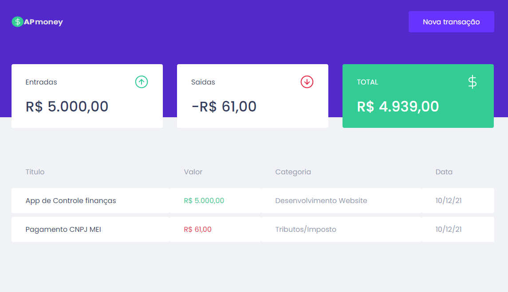

<h1 align="center">
        
</h1>

## Tecnologias

-  [Typescript](https://www.typescriptlang.org/)
-  [ReactJS](https://reactjs.org/)
-  [MirageJS](https://miragejs.com)
-  [Styled-Components](https://styled-components.com)
-  [Axios](https://axios-http.com)

## Como Executar

- ### **Pré-requisitos**

  - É **necessário** possuir o **[Node.js](https://nodejs.org/en/)** instalado no computador
  - É **necessário** possuir o **[Git](https://git-scm.com/)** instalado e configurado no computador
  - Também, é **preciso** ter um gerenciador de pacotes seja o **[NPM](https://www.npmjs.com/)** ou **[Yarn](https://yarnpkg.com/)**.
  

1. Faça um clone do repositório:

```sh
  $ git remote add origin https://github.com/aleksanderpalamar/ap-money.git
```

2. Executando a Aplicação:

```sh
  # Aplicação web
  $ cd ap-money
  # Instalando as dependências do projeto.
  $ yarn # ou npm install
  # Inicie a aplicação web
  $ yarn start # ou npm start
```